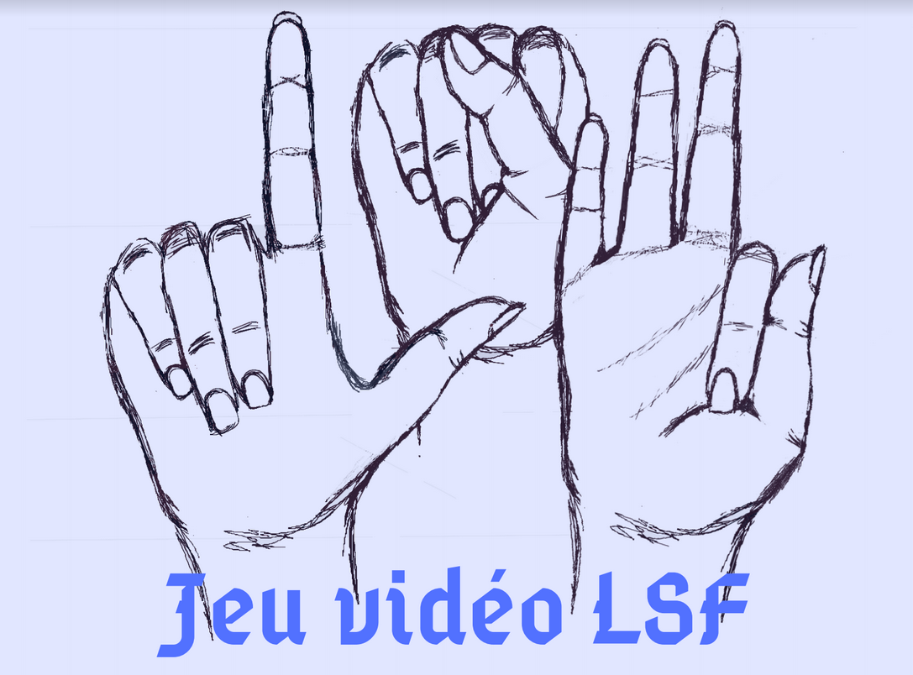

# JeuLSF
Projet destiné aux débutants en LSF (Langue des Signes Française) qui voudraient s'y initier de façon ludique.

L'objectif de ce jeu codé avec Ren'Py (basé sur le language Python) et utilisant notamment Face Rig est donc d'apprendre sans difficulté et en s'amusant la LSF pour tout âge et tout niveaux (sauf très avancé).

